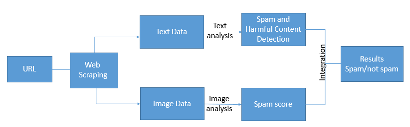
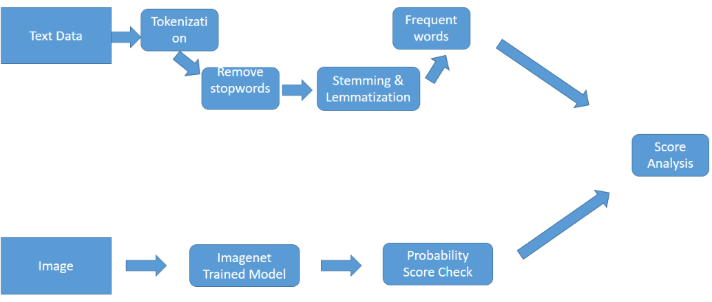
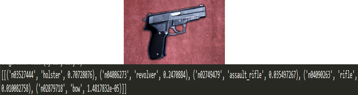
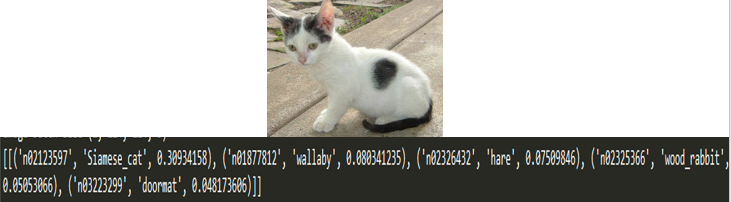
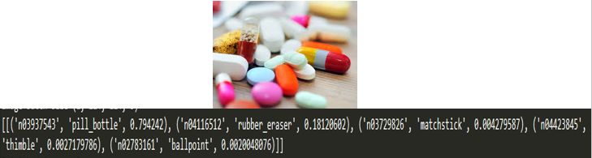

# Healthy Search With AI

Integrate Ai With Firefox that will make the search more healthy and secure. We developed an AI model that will analyse the data from the web page while loading and prompt a alert if there is a spam content based on Image and Text content Analysis.

## Project Theme

A Firefox extension that will make the search more healthy and secure. We developed an AI model that will analyse the data from the web page while loading and prompt a alert if there is a spam content. It will also recognize harmful content like crime related stories. In this project we scrapped all the text and images in a web page and analyse spam, harmful content by using pre-trained model.

We are trying to make this better and more secure search by including fully trained model. We are also trying to add new feature named "children zone". In this zone we are blocking all the webpage which are having adult and harmful content.

## Approach Model
#### Main Model

#### Detailed Architecture

### Text Analysis
* Fetching text from web page
* Preprocessing
    * Text
    * Tokenization
    * Remove stop words
    * Stemming
    * Lemmatization
  * Most Frequent words
* Spam Analysis

### Image Analysis
* Fetching images from web page
* Neural network model
* Probability scores
* Spam Analysis

     
     
     
